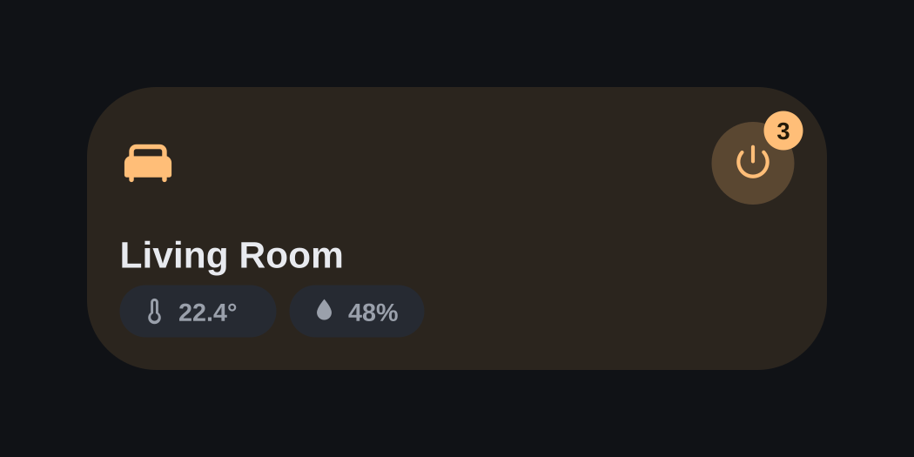
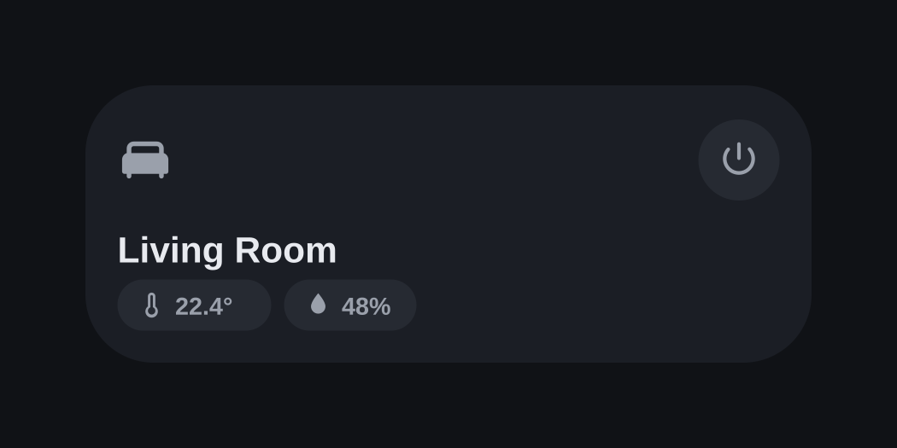
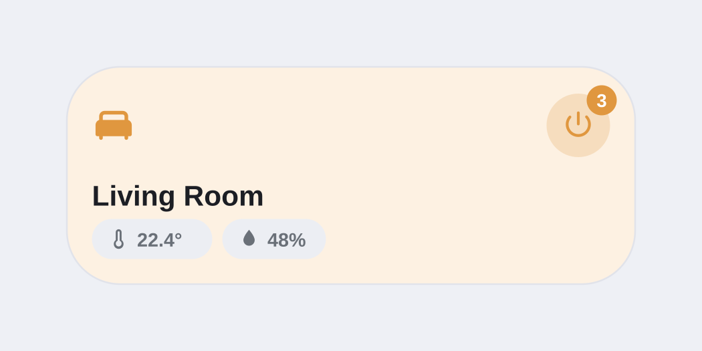
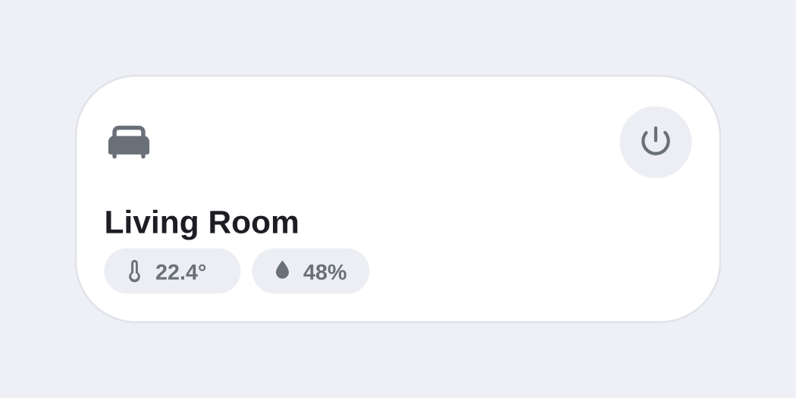

# NavRoom Card

A room overview card for Home Assistant that tints itself in the color of
your lights. Area-aware, auto-discovering, fully UI-configurable, zero
dependencies.


## Preview

| | Lights on | Lights off |
|---|---|---|
| **Dark mode** |  |  |
| **Light mode** |  |  |

## Features

- **Auto-discovery** – just set an area and the card finds the light
  (group preferred) and temperature/humidity/CO2 sensors on its own.
  Manual pickers always override the automatic choice.
- **Area integration** – name and icon are pulled automatically from the
  Home Assistant area registry. Change the area icon once, every card follows.
- **Light-color accent** – when lights are on, the card computes the average
  RGB color of all active lights (group members or a single light) and uses it
  to tint icon, background, power button and badge.
- **Power button with counter badge** – toggles the room's lights; the badge
  shows how many lights are currently on. Fully configurable action.
- **Sensor chips** – temperature, humidity and CO2 with identifying icons.
  CO2 turns amber at 1000 ppm and red at 1500 ppm. Chips scroll horizontally
  when the row gets too wide. Missing sensors are skipped entirely; an
  unavailable sensor shows "–".
- **Sortable chip order** – arrange the chips per card with arrow buttons in
  the editor.
- **Three layout variants** – counter badge, lights chip, or plain.
- **Theme-adaptive design** – corner radius, border and shadow follow the
  active theme unless explicitly configured.
- **Standard HA actions** – tap / hold / double-tap for the card plus a
  separate action for the power button, using the native action selector.
- **Full UI editor** – area picker, filtered entity pickers, design sliders,
  a design reset button and live preview. No YAML required.
- **i18n** – English and German, auto-detected from the user profile.
- Build-free vanilla JavaScript, no dependencies.

## Installation

### HACS (custom repository)

1. HACS → three-dot menu → *Custom repositories*
2. Add this repository URL, category **Dashboard**
3. Install **NavRoom Card** and reload your browser

### Manual

1. Copy `navroom-card.js` to `config/www/`
2. Add a dashboard resource:
   `/local/navroom-card.js` (type: JavaScript module)

## Configuration

Everything can be configured through the visual editor. Thanks to
auto-discovery, the minimal config is a single line:

```yaml
type: custom:navroom-card
area: living_room
```

Full example with manual overrides:

```yaml
type: custom:navroom-card
area: living_room
light: light.living_room_group
temp: sensor.living_room_temperature
humidity: sensor.living_room_humidity
co2: sensor.living_room_co2
variant: badge
chip_order:
  - temp
  - humidity
  - co2
  - light
tap_action:
  action: navigate
  navigation_path: /lovelace/living-room
```

### Options

| Option | Type | Default | Description |
|---|---|---|---|
| `area` | string | – | Area ID; provides name, icon and auto-discovery |
| `light` | entity | auto-discovered | Light group or single light |
| `temp` | entity | auto-discovered | Temperature sensor |
| `humidity` | entity | auto-discovered | Humidity sensor |
| `co2` | entity | auto-discovered | CO2 sensor (ppm, with warning colors) |
| `variant` | string | `badge` | `badge`, `chip` or `pur` |
| `chip_order` | list | `[temp, humidity, co2, light]` | Chip display order |
| `tap_action` | action | more-info | Card tap |
| `hold_action` | action | – | Card hold |
| `double_tap_action` | action | – | Card double tap |
| `power_action` | action | toggle light | Power button tap |
| `name` / `icon` | string | from area | Manual overrides |
| `height`, `radius`, `icon_size`, `name_size`, `chip_height`, `chip_font`, `pwr_size`, `badge_size`, `bg_tint`, `accent_fallback` | number/string | see editor | Design options (unset values adapt to the theme) |

## License

MIT
